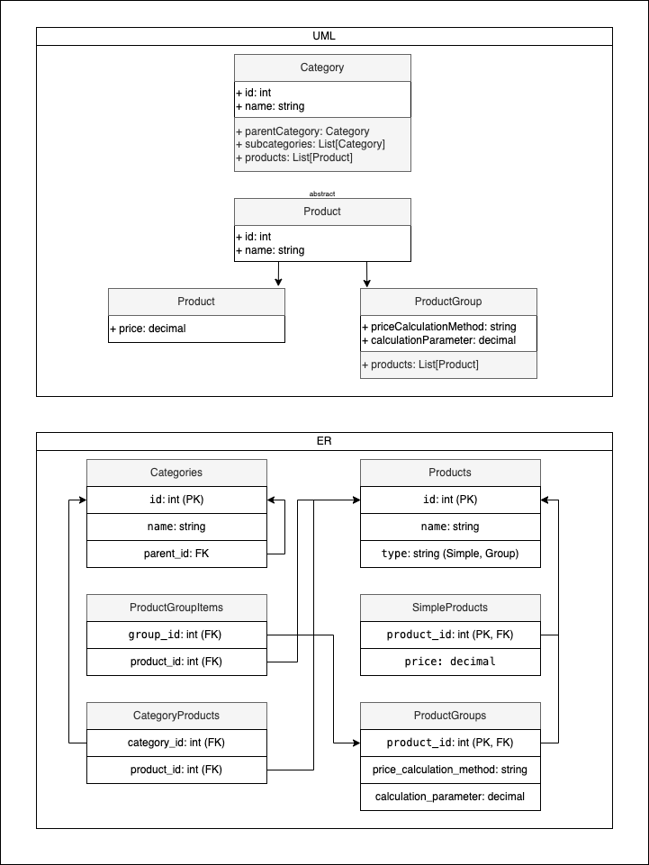
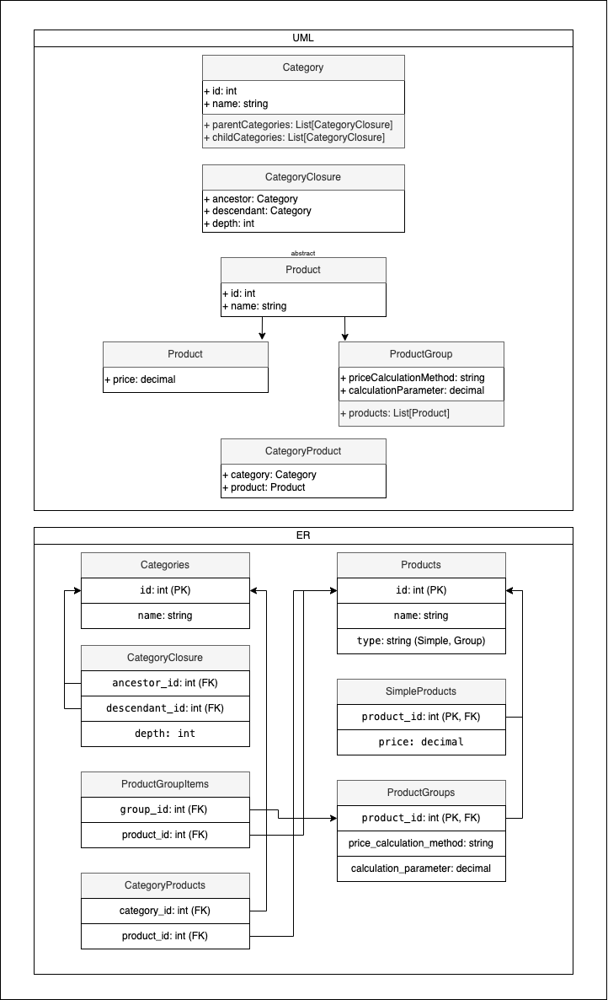

# Тестовое задание для компании РИТМ (hh.ru)

## Первый вариант

### Объяснение
1. В этом варианте все просто. Мы создаем обычное дерево, где категории сами ссылаются на себя. Подход достаточно стандартный, но у него есть свои минусы. Главный минус это то, что глубокая иерархия категорий может привести к проблемам с производительностью при выборке товаров из категории и всех её подкатегорий. 

2. По поводу наследования и абстрактного класса Product. Возможно, это избыточное решение, но зато оно жестко стандартизирует наши данные и позволяет с легкостью масштабирать нашу архитектуру при необходимости.

3. Ассоциации и композиции:
   - Category ассоциирована с Product, что позволяет одной категории содержать множество товаров.
   - ProductGroup композитно связана с Product, так как удаление группы может повлиять на содержащиеся в ней товары (хотя тут все зависит от бизнес-логики).

4. Так как в условиях не было уточнения по поводу товаров и категорий я сделал возможность конкретному продукту иметь сразу несколько категорий, так как такое часто встречается в онлайн-магазинах.

## Второй вариант

